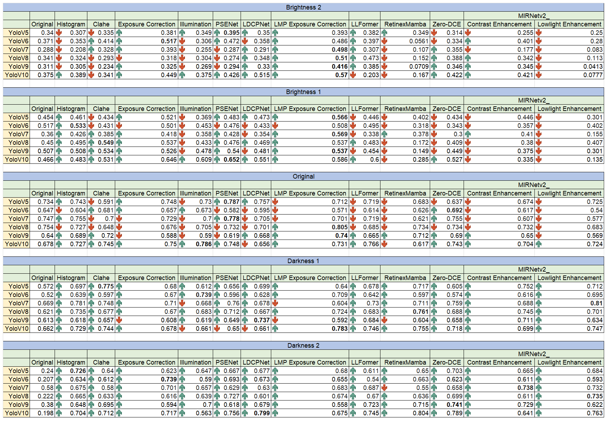

# Advanced Detection of Life Jackets in Maritime Environments Using YOLO Algorithms

> **Companion repository for:**
> *Enhancing Life Jacket Detection for Maritime Search and Rescue Using YOLO Models and Illumination-Robust Preprocessing Techniques.*
> Kwong Jun Kit, Kwan Ban Hoe, Tan Tian Swee, Hum Yan Chai.
> Universiti Tunku Abdul Rahman & Universiti Teknologi Malaysia.

---

## Overview

Maritime Search and Rescue (SAR) operations are constrained by vast search zones, poor visibility and extreme lighting — especially during night-time missions. This project investigates whether modern object-detection algorithms can automate **life jacket detection** to make SAR faster and more reliable.

The study contributes a **two-fold methodology**:

1. **Benchmarking** the YOLO family (**v5 through v12**), together with **SSD** and **Faster R-CNN**, on a custom life-jacket dataset.
2. **Illumination-robust preprocessing** — exposure correction and low-light image enhancement (LLIE) — applied before detection to recover accuracy under overexposed and underexposed conditions.

Across all experimental conditions, **YOLOv10** consistently delivered the best precision while keeping real-time inference speed and a compact model size, making it the most promising candidate for time-sensitive SAR deployment.

---

## Key Contributions

- **Custom dataset** of 1,630 annotated images covering four distinct life-jacket categories — Offshore, Near-Shore Buoyant Vest, Floatation Aid, and Inflatable — addressing the lack of publicly available SAR-specific data.
- **Comprehensive benchmark** of YOLOv5 → YOLOv12 plus SSD and Faster R-CNN under one fixed training protocol.
- **Lighting-stress evaluation** across five conditions per test image — original (`O`), two overexposure levels (`B1`, `B2`) and two underexposure levels (`D1`, `D2`) — quantifying robustness to illumination shift.
- **Preprocessing study** of 12 enhancement methods (classical + deep learning) applied to the lighting-stressed test set, identifying *Learning Multi-Scale Photo Exposure Correction* as the most consistent overexposure fix and *MIRNetv2* (NTIRE 2024 top performer) as the strongest LLIE method.
- **Released artefacts**: dataset, the 6,000-image preprocessing × lighting ablation grid, configs, and trained weights for every YOLO version plus SSD and Faster R-CNN — so every result can be reproduced or extended.

---

## Dataset — *Types of Life Jacket*

|  |  |  |  |
| --------------------------- | ------------------------------ | --------------------- | ----------------------------- |
| Type 1 Offshore Life Jacket | Type 2 Near-Shore Buoyant Vest | Type 3 Floatation Aid | Type 4 Inflatable Life Jacket |

**Class-wise distribution (1,630 images total)**

| Class                              | Train | Val | Test | Total |
| ---------------------------------- | ----- | --- | ---- | ----- |
| Type 1 — Offshore Life Jacket      | 297   | 23  | 25   | 345   |
| Type 2 — Near-Shore Buoyant Vest   | 312   | 20  | 25   | 357   |
| Type 3 — Floatation Aid            | 326   | 29  | 25   | 380   |
| Type 4 — Inflatable Life Jacket    | 300   | 28  | 25   | 353   |
| Others (Background)                | 195   | 0   | 0    | 195   |
| **Total**                          | 1430  | 100 | 100  | 1630  |

Annotations were produced manually with **LabelImg** in YOLO format. Dataset configuration files are provided for both the standard YOLO (`Custom_dataset/dataset.yaml`) and YOLOv7 (`Custom_dataset/Yolo7_dataset.yaml`) layouts.

The test split (`Custom_dataset/images/test/`) is itself organised into the five lighting conditions used in the robustness study — `O` (original), `B1` / `B2` (overexposed levels 1 and 2), `D1` / `D2` (underexposed levels 1 and 2). The preprocessing-method outputs (`Custom_dataset/images/<NN> <Method>/`) follow the same `O / B1 / B2 / D1 / D2` substructure, giving a 12 × 5 ablation grid.

---

## Repository Structure

```
.
├── Custom_dataset/
│   ├── dataset.yaml                # YOLO v5/6/8/9/10/11/12 config
│   ├── Yolo7_dataset.yaml          # YOLOv7-style config
│   ├── images/
│   │   ├── train/                              # 1,430 training images
│   │   ├── val/                                # 100 validation images
│   │   ├── test/                               # 100 test images per lighting condition
│   │   │   └── O/ B1/ B2/ D1/ D2/              # 5 lighting conditions
│   │   └── <NN> <Method>/                      # 12 preprocessing-method outputs
│   │       └── O/ B1/ B2/ D1/ D2/              # same 5 lighting conditions, post-preprocessing
│   └── labels/                     # YOLO-format annotations (train/val/test)
├── Trained_weights/
│   ├── Yolov5/                     # full Ultralytics training-output dir per version
│   │   ├── args.yaml               # exact training hyperparameters used
│   │   ├── results.csv  results.png
│   │   ├── F1_curve.png  P_curve.png  R_curve.png  PR_curve.png
│   │   ├── confusion_matrix.png  confusion_matrix_normalized.png
│   │   └── weights/best.pt         # canonical inference checkpoint
│   ├── Yolov6/  Yolov7/  Yolov8/  Yolov9/  Yolov10/  Yolov11/  Yolov12/
│   ├── SSD/customTF2/              # TF Object Detection API baseline
│   │   ├── data/label_map.pbtxt
│   │   ├── data/pipeline.config
│   │   └── model/saved_model/      # exported, ready for inference
│   └── FasterRCNN/                 # TF Object Detection API baseline
│       ├── data/label_map.pbtxt
│       ├── data/pipeline.config
│       └── model/saved_model/      # weights tracked via Git LFS (228 MB shard)
├── Result.png                      # Qualitative results figure
└── README.md
```

> **Note on the preprocessing folders.** `Custom_dataset/images/<NN> <Method>/` holds the test set after each lighting-robust preprocessing technique has been applied. The 5 sub-directories per method correspond to lighting conditions: `O` = original, `B1` / `B2` = overexposed (level 1 / 2), `D1` / `D2` = underexposed (level 1 / 2). The full ablation grid is therefore *12 methods × 5 lighting conditions × 100 test images = 6,000 evaluation images*.

> **Note on the SSD / Faster R-CNN folders.** Only the *exported* artefacts (`saved_model/`, `pipeline.config`, `label_map.pbtxt`) are version-controlled. Intermediate training checkpoints, TensorBoard logs (`events.out.tfevents.*`), and TFRecord shards (`*.record`) are excluded via `.gitignore` because they are large, contain transient hostnames, or are derivable from `Custom_dataset/`.

> **Note on the YOLO folders.** Each `Yolov<N>/` directory is the Ultralytics training-output snapshot for that version, retained for verification. Only `weights/best.pt` is needed for inference; intermediate `epoch*.pt` / `last.pt` checkpoints and TensorBoard event logs are excluded via `.gitignore`.

---

## Experimental Setup

Shared across **all** models:

| Item             | Value                                              |
| ---------------- | -------------------------------------------------- |
| Hardware         | Google Colab — NVIDIA Tesla **T4** GPU             |
| Runtime          | Python 3.10.12 · PyTorch 2.3.1 · TensorFlow 2.15.1 |
| Input resolution | **320 × 320**                                      |
| Batch size       | **5**                                              |
| Training duration | **300 epochs** (= 85,800 gradient steps for 1,430 train images at batch 5) |
| Annotation tool  | LabelImg                                           |

Optimizer choice follows each framework's tuned defaults — forcing one optimizer across both ecosystems would push them out of their well-validated regimes:

| Model family                           | Optimizer        | LR schedule                       | Source of defaults                    |
| -------------------------------------- | ---------------- | --------------------------------- | ------------------------------------- |
| YOLOv5 → YOLOv12                       | **Adam**         | Ultralytics built-in              | Ultralytics framework defaults        |
| SSD (TF Object Detection API)          | **Momentum SGD** | Cosine decay, 2,500-step warmup   | TF Model Zoo `ssd_*` template         |
| Faster R-CNN (TF Object Detection API) | **Momentum SGD** | Cosine decay, 2,500-step warmup   | TF Model Zoo `faster_rcnn_*` template |

This keeps each detector in the configuration regime its authors validated, while **input resolution, batch size, and epoch count are held constant** — the variables most directly responsible for "how much, and how fine-grained, the training signal is."

> The published `Trained_weights/FasterRCNN/` checkpoint was originally trained at `batch_size: 3` due to T4 memory constraints. The `pipeline.config` shipped here has been **updated to `batch_size: 5`** to match the rest of the benchmark. Re-running training at this batch size requires verification that it fits in T4 memory; if it OOMs, see the *Reproducibility note* below.

### Reproducibility note — Faster R-CNN at batch 5

Faster R-CNN with the Inception-ResNet-V2 backbone at 320 × 320 sits close to the Tesla T4's 16 GB ceiling. If `batch_size: 5` triggers an OOM on your hardware, the equivalence holds with **either** of these adjustments:

- Keep `batch_size: 3` and set `num_steps: 143000` and `total_steps: 143000` — same data exposure as 300 epochs at batch 5.
- Use a higher-VRAM GPU (e.g. A100, V100 16 GB, RTX 3090) where batch 5 fits.

Document whichever path you took in your training logs.

---

## Results

### Overall detection accuracy on the custom dataset (all classes)

| Model        | Precision | Recall | mAP@0.5 | mAP@0.5:0.95 |
| ------------ | --------- | ------ | ------- | ------------ |
| YOLOv5       | 0.535     | 0.572  | 0.553   | 0.372        |
| YOLOv6       | 0.522     | 0.603  | 0.577   | 0.399        |
| YOLOv7       | 0.567     | 0.601  | 0.577   | 0.373        |
| YOLOv8       | 0.568     | 0.514  | 0.596   | 0.413        |
| YOLOv9       | 0.633     | 0.492  | 0.591   | 0.425        |
| YOLOv10      | 0.630     | 0.499  | 0.565   | 0.401        |
| YOLOv11      | 0.571     | 0.580  | 0.595   | 0.425        |
| YOLOv12      | 0.569     | 0.424  | 0.525   | 0.356        |
| SSD          | 0.449     | 0.594  | 0.485   | 0.273        |
| Faster R-CNN | 0.481     | 0.634  | 0.508   | 0.357        |

*Numbers correspond to **Table 6** in the paper — end-of-training **validation-set** performance (n = 100 validation images), used during model development. Column leaders: YOLOv9 on precision (0.633), Faster R-CNN on recall (0.634), YOLOv8 on mAP@0.5 (0.596); YOLOv9 and YOLOv11 tie on mAP@0.5:0.95 (0.425). The lighting-stress evaluation in §4 uses the **test set** (n = 100 test images), reported in Table 8 of the paper — small numerical differences between the two slices are expected and explicitly discussed in the manuscript.*

<div align="center">
    
</div>

### Robustness under varying lighting

Every model was re-evaluated across **five lighting conditions** — original (`O`), two overexposure levels (`B1`, `B2`), and two underexposure levels (`D1`, `D2`) — both without preprocessing (Table 8 in the paper) and with each of the 12 preprocessing methods (Tables 9–13). Headline winners reported in the paper's conclusion:

- **Overexposure** → *Learning Multi-Scale Photo Exposure Correction* ([Afifi et al.](https://github.com/mahmoudnafifi/Exposure_Correction)) — most consistent gains across overexposed scenarios.
- **Low-light**    → **MIRNetv2** ([Zamir et al.](https://github.com/swz30/MIRNetv2)) — a top performer in the NTIRE 2024 Challenge; most effective in underexposed scenarios overall.

Applying these preprocessors before YOLOv10 inference recovered most of the accuracy lost to illumination extremes, validating the two-stage *enhance-then-detect* design for maritime SAR.

---

## Quick Start

### 1. Install Ultralytics (covers YOLOv5/6/8/9/10/11/12)

```bash
pip install ultralytics
```

For YOLOv7, follow the [official YOLOv7 repo](https://github.com/WongKinYiu/yolov7) and use `Custom_dataset/Yolo7_dataset.yaml`.

### 2. Run inference with a released checkpoint

```python
from ultralytics import YOLO

model = YOLO("Trained_weights/Yolov10/weights/best.pt")
results = model.predict(
    source="Custom_dataset/images/test/O",   # original-lighting test images
    imgsz=320,
    conf=0.25,
    save=True,
)
```

### 3. Re-train from scratch on the dataset

```bash
yolo detect train \
  data=Custom_dataset/dataset.yaml \
  model=yolov10s.yaml \
  imgsz=320 batch=5 epochs=300 \
  optimizer=Adam lr0=0.001 \
  project=Trained name=Yolov10 save_period=100
```

### 4. Evaluate the preprocessing × lighting ablation grid

To replicate the lighting-robustness study, point `data:` at a YAML whose `test:` field references one of:

- `Custom_dataset/images/<NN> <Method>/O` — preprocessing applied to the original-lighting test set
- `Custom_dataset/images/<NN> <Method>/B1` or `B2` — applied to the overexposed test sets
- `Custom_dataset/images/<NN> <Method>/D1` or `D2` — applied to the underexposed test sets

Then run `yolo detect val …` to obtain precision, recall, mAP@0.5, and mAP@0.5:0.95 for that cell of the grid.

### 5. Run the SSD or Faster R-CNN baseline (TensorFlow)

```python
import tensorflow as tf
from object_detection.utils import label_map_util

detect_fn = tf.saved_model.load(
    "Trained_weights/SSD/customTF2/model/saved_model"
    # or: "Trained_weights/FasterRCNN/model/saved_model"
)
category_index = label_map_util.create_category_index_from_labelmap(
    "Trained_weights/SSD/customTF2/data/label_map.pbtxt",
    use_display_name=True,
)

import numpy as np, cv2
img = cv2.imread("Custom_dataset/images/test/O/Testing1 (1).jpg")
input_tensor = tf.convert_to_tensor(img[None, ...])
detections = detect_fn(input_tensor)
```

Both baselines were trained with the **TensorFlow Object Detection API (TF2)**. The shipped `pipeline.config` files contain Colab-style absolute paths (`/content/customTF2/...`) — edit them to point at this repo before retraining.

### Downloading Faster R-CNN weights (Git LFS)

The Faster R-CNN `variables.data-*` weight shard is ~228 MB, which exceeds GitHub's 100 MB per-file limit. We therefore distribute it through **Git LFS**. Clone like this:

```bash
# One-time setup on your machine
git lfs install

# Clone the repo — LFS-tracked files are pulled automatically
git clone https://github.com/MikeJ-97/Advanced-Detection-of-Life-Jackets-in-Maritime-Environments-Using-YOLO-Algorithms.git

# If you cloned before installing LFS, fetch the large files now
cd Advanced-Detection-of-Life-Jackets-in-Maritime-Environments-Using-YOLO-Algorithms
git lfs pull
```

The LFS-tracked pattern is declared in `.gitattributes`:

```
Trained_weights/**/saved_model/variables/variables.data-* filter=lfs diff=lfs merge=lfs -text
```

If `git lfs pull` fails, the SavedModel will load but inference will produce garbage — verify with `git lfs ls-files` that `variables.data-00000-of-00001` is listed.

### Regenerating the TFRecord files

`*.record` files are excluded from version control. To rebuild them from `Custom_dataset/`, run the standard TF OD helpers (`generate_tfrecord.py`) using the existing `pipeline.config` paths.

---

## Acknowledgements
<details><summary><b>Expand</b></summary>

### Preprocessing methods evaluated in the lighting-robustness study

The 12 enhancement techniques benchmarked in `Custom_dataset/images/<NN> <Method>/` are:

| #  | Method                                          | Type            | Reference                                                                                            |
| -- | ----------------------------------------------- | --------------- | ---------------------------------------------------------------------------------------------------- |
| 1  | Histogram Equalization                          | Classical       | OpenCV `cv2.equalizeHist`; refs [110–114] in the paper                                               |
| 2  | CLAHE                                           | Classical       | OpenCV `cv2.createCLAHE`; Reza, *J. VLSI Signal Process.* (2004) [140]                               |
| 3  | Exposure-Correction-BMVC-2021 (Nsampi et al.)   | Deep learning   | [github.com/elientumba2019/Exposure-Correction-BMVC-2021](https://github.com/elientumba2019/Exposure-Correction-BMVC-2021) |
| 4  | Illumination Adaptive Transformer (Cui et al.)  | Deep learning   | [arxiv.org/abs/2205.14871](https://arxiv.org/abs/2205.14871)                                         |
| 5  | PSENet — Progressive Self-Enhancement Network (Nguyen et al.) | Deep learning | [arxiv.org/abs/2210.00712](https://arxiv.org/abs/2210.00712)                            |
| 6  | LCDPNet (Wang et al.)                           | Deep learning   | [hywang99.github.io/lcdpnet](https://hywang99.github.io/lcdpnet/)                                    |
| 7  | Learning Multi-Scale Photo Exposure Correction (Afifi et al.) — **best overexposure method in this study** | Deep learning | [github.com/mahmoudnafifi/Exposure_Correction](https://github.com/mahmoudnafifi/Exposure_Correction) |
| 8  | LLFormer (Wang et al.)                          | Deep learning   | [arxiv.org/abs/2212.11548](https://arxiv.org/abs/2212.11548)                                         |
| 9  | RetinexMamba (Bai et al.)                       | Deep learning   | [arxiv.org/abs/2405.03349](https://arxiv.org/abs/2405.03349)                                         |
| 10 | Zero-DCE (Guo et al., CVPR 2020)                | Deep learning   | [github.com/Li-Chongyi/Zero-DCE](https://github.com/Li-Chongyi/Zero-DCE)                             |
| 11 | MIRNetv2 — Color Enhancement variant (Zamir et al.) | Deep learning | [github.com/swz30/MIRNetv2](https://github.com/swz30/MIRNetv2)                                       |
| 12 | MIRNetv2 — Low-Light Enhancement variant (Zamir et al.) — **best low-light method in this study (NTIRE 2024 winner)** | Deep learning | [github.com/swz30/MIRNetv2](https://github.com/swz30/MIRNetv2) |

### Detection frameworks

* **Ultralytics YOLO** — [github.com/ultralytics/ultralytics](https://github.com/ultralytics/ultralytics) — training & evaluation framework for YOLOv5, v6, v8–v12.
* **YOLOv7** — [github.com/WongKinYiu/yolov7](https://github.com/WongKinYiu/yolov7).
* **TensorFlow Object Detection API** — used for the SSD and Faster R-CNN baselines.

### Funding

We gratefully acknowledge **Universiti Tunku Abdul Rahman** for supporting this research.

</details>

---

## Citation

If you use this dataset, code, or trained weights, please cite the paper:

```bibtex
@article{kwong2025lifejacket,
  title   = {Enhancing Life Jacket Detection for Maritime Search and Rescue Using YOLO Models and Illumination-Robust Preprocessing Techniques},
  author  = {Kwong, Jun Kit and Kwan, Ban Hoe and Tan, Tian Swee and Hum, Yan Chai},
  journal = {TODO: journal name once accepted},
  year    = {TODO},
  doi     = {TODO}
}
```

> **TODO — fill in once the paper is accepted/published:** journal name, year, volume/pages, and DOI.

---

## Author Contributions

- **Kwong Jun Kit** — Conceptualization, Methodology, Software, Formal Analysis, Investigation, Writing (Original Draft).
- **Kwan Ban Hoe** — Data Curation, Visualization, Validation, Writing (Review & Editing).
- **Tan Tian Swee** — Supervision, Resources, Project Administration, Writing (Review & Editing).
- **Hum Yan Chai** — Conceptualization, Supervision, Funding Acquisition, Methodology, Writing (Review & Editing).

## Competing Interests

The authors declare no competing interests.

---

## License

<!-- DECISION POINT — see README review notes -->
*TODO: choose a license (e.g. MIT for code + CC-BY-4.0 for the dataset/weights) and add a `LICENSE` file.*
